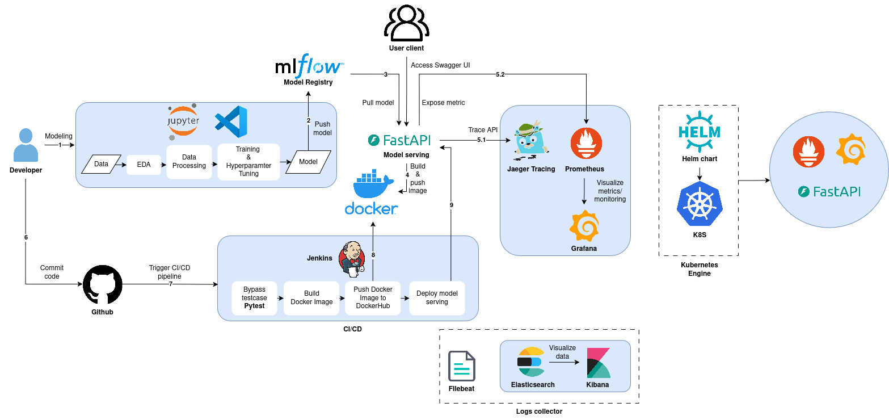

# Stroke Prediction Model Deployment
**Table of contents**\
    1. [Introduction](#introduction)\
    2. [Repository structure](#repository-structure)\
    3. [Prerequisites installation](#prerequisites-installation)\
    4. [Deploy Docker services](#deploy-docker-services)\
    5. [Deploy K8S services](#deploy-k8s-services)

## Introduction
This is an educational project focused on how to design and implement a MLOps workflow. This repo provides a comprehensive guide on building and deploying machine learning models through a complete pipeline, incorporating CI/CD practices and resource management, when also demonstrates the practical application of MLOps solutions to address real-world challenges in deploying AI/ML systems at scale.

- Source code versioning and control: Git/Github
- Containerization: Docker
- Manage and orchestrate containerized applications: K8S, Helm
- Model registry: MLflow
- Model serving: FastAPI
- CI/CD: Jenkins
- Model span tracing: Jaeger Tracing
- Metrics collector: Prometheus,Cadvisor
- Metrics visualization: Grafana
- Logs collector: ElasticSearch, Kibana


## Repository structure
```shell
Stroke-Risk-Prediction-ML-System/
    ├── dataset/                         # **Data directory**
    │   ├── raw_data/                    # Raw input data
    │   └── processed_data/              # Cleaned and processed data
    │
    ├── src/                             # **Source code**
    │   ├── notebook/                    # Jupyter notebooks for EDA and experiments
    │   └── scripts/                     # Training pipeline scripts (Log model to MLflow)
    │   ├── deploy.sh                    # Shell script for deployment Model serving API
    │
    ├── model/                           # **Trained model files**
    │   └── stroke_pred_model.joblib     # Serialized model object
    ├── tests/                           # **Pytest script**
    │
    ├── service/                         # **MLOps infrastructure services deployment using Docker**
    │   ├── alertmanager/                # Alertmanager configs
    │   ├── elk/                         # ELK stack for logging
    │   └──└── elk-docker-compose.yml    # Docker Compose for ELK services
    │   ├── grafana/                     # Grafana dashboards
    │   ├── jenkins/                     # Jenkins pipelines/config
    │   └──└── docker-compose.yml        # Docker Compose for Jenkins service
    │   ├── MLflow/                      # MLflow tracking setup
    │   │   └──└── docker-compose.yml    # Docker Compose for MLflow service
    │   ├── model_api_serving/           # FastAPI or Flask model serving code
    │   │   └──└── docker-compose.yml    # Docker Compose for FastAPI model serving service
    │   └── prometheus/                  # Prometheus monitoring setup
    │   ├── prom-graf-jaeger-docker-compose.yaml  # Docker Compose for services (Prometheus, Grafana, Jaeger)
    │   ├── README.md                    # Guide for set up services on Docker 
    │
    ├── k8s/                             # **Helm chart to deploy services to K8S**
    │   ├── grafana_chart/               # Helm chart for Grafana
    │   ├── prometheus_chart/            # Helm chart for Prometheus
    │   └── stroke-api-chart/            # Helm chart for the stroke prediction API
    │   ├── README.md                    # Guide for set up services on K8S
    │
    ├── references/images                # References images
    │   Jenkinsfile                      # CI/CD pipeline using Jenkins
    ├── requirements.txt                 # Python dependencies
    └── README.md                        # Project overview and documentation
```

## Prerequisites installation
```shell
pip install requirements.txt
```                         


## Deploy Docker services
**See more details about installation in /service/README.md**
### MLflow
```shell
cd service/mlflow/
docker-compose up --build
```
Run training script to push model to MLflow. Training script is available in:
```shell
/src/train_src/registry_model_2_mlflow.py
```

### MODEL SERVING API
```shell
cd service/model_api_serving/
docker-compose up --build
```

### JAEGER TRACING & PROMETHEUS & GRAFANA
```shell
cd service/
docker compose -f prom-graf-jaeger-docker-compose.yaml up -d
```

### ELK
```shell
cd service/elk/
docker compose -f elk-docker-compose.yml up -d # Set up ELastic search and Kibana
docker compose -f elk-docker-compose.yml -f extensions/filebeat/filebeat-compose.yml up # Set up Filebeat
```

### JENKINS
```shell
cd service/jenkins/
docker-compose up --build
```

## Deploy K8S services
**See more details about installation in /k8s/README.md**
### PREPARATION
```shell
minikube start
kubectl create namespace monitoring
kubectl create namespace deployed-api
```

### PROMETHEUS
```shell
cd k8s/prometheus_chart/
helm install prometheus-k8s ./prometheus --namespace monitoring
kubectl expose service prometheus-k8s-server \
  --namespace monitoring \
  --type=NodePort \
  --target-port=9090 \
  --name=prometheus-k8s-server-ext
```

### GRAFANA
```shell
cd k8s/grafana_chart/
helm install grafana-k8s ./grafana --namespace monitoring
kubectl expose service grafana-k8s \
  --namespace monitoring \
  --type=NodePort \
  --target-port=3000 \
  --name=grafana-k8s-ext
```

### MODEL SERVING API
```shell
cd k8s/stroke-api-chart/
helm install stroke-api-k8s . -n deployed-api
```


